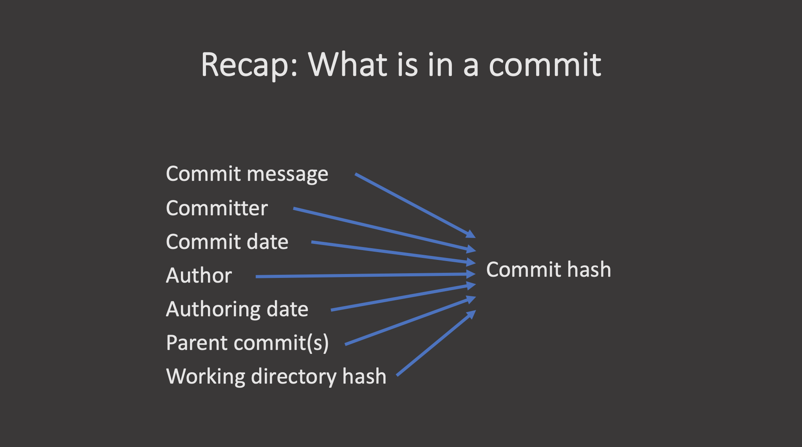

## Introduction

Version control systems are a way to keep track of changes in text-based documents. We start with a base version of the document and then record the changes you make each step of the way. You can think of it as a recording of your progress: you can rewind to start at the base document and play back each change you made, eventually arriving at your more recent version.

The git version control system, used to manage the code in many millions of software projects, is one of the most widely adopted one. It uses a distributed version control model (the "beautiful graph theory tree model"), meaning that there is no single central repository of code. Instead, users share code back and forth to synchronise their repositories, and it is up to each project to define processes and procedures for managing the flow of changes into a stable software product.

## Challenges

Git is powerful and flexible to fit a wide range of use cases and workflows from simple projects written by a single contributor to projects that are millions of lines and have hundreds of co-authors. Furthermore, it does a task that is quite complex. As a result, many users may find it challenging to navigate this complexity. While committing and sharing changes is fairly straightforward, for instance, but recovering from situations such as accidental commits, pushes or bad merges is difficult without a solid understanding of the rather large and complex conceptual model. Case in point, three of the top five highest voted questions on Stack Overflow are questions about how to carry out relatively simple tasks: undoing the last commit, changing the last commit message, and deleting a remote branch.

Mouse-over text: If that doesn't fix it, git.txt contains the phone number of a friend of mine who understands git. Just wait through a few minutes of 'It's really pretty simple, just think of branches as...' and eventually you'll learn the commands that will fix everything.

With this lesson our goal is to give a you a more in-depth understanding of the conceptual model of git, to guide you through increasingly complex workflows and to give you the confidence to participate in larger projects.

## Review of Intro Git Commands

First, lets review the concepts and commands that constitute the basic git workflow.

~~~
git init
~~~
{: .language-bash}

~~~
git add file.txt
git commit -m "Message"
~~~
{: .language-bash}

A commit, or "revision", is an individual change to a file or set of files. It's like when you save a file, except with `git`, every time you save it creates a unique ID (a.k.a. the "SHA" or "hash") that allows you to keep record of what changes were made when and by who. Commits usually contain a commit message which is a brief description of what changes were made.

~~~
git log
git status
git diff
git checkout HEAD file.txt
git revert
~~~
{: .language-bash}

`git checkout` returns the files not yet committed within the local repository to a previous state, whereas `git revert` reverses changes committed to the local and project repositories.

~~~
git clone http://....
~~~
{: .language-bash}

~~~
git push
~~~
{: .language-bash}

~~~
git pull
~~~
{: .language-bash}

Finally, the `git fetch` command downloads commits, files, and refs from a remote repository into your local repo. When downloading content from a remote repo, `git pull` and `git fetch` commands are available to accomplish the task. You can consider git fetch the 'safe' version of the two commands. It will download the remote content but not update your local repo's working state, leaving your current work intact. `git pull` is the more aggressive alternative; it will download the remote content for the active local branch and immediately execute `git merge` to create a merge commit for the new remote content. If you have pending changes in progress this will cause conflicts and kick-off the merge conflict resolution flow. The following command will bring down __all__ the changes from the remote:

~~~
git fetch
~~~
{: .language-bash}

It is sometimes useful to only pull the changes from a certain branch, e.g., `main`. For a repository that has a lot of contributors and branches, all the changes may be unnecessary and overwhelming:

~~~
git fetch origin main
~~~
{: .language-bash}

https://www.atlassian.com/git/tutorials/syncing/git-fetch

[comment]: <> ()


