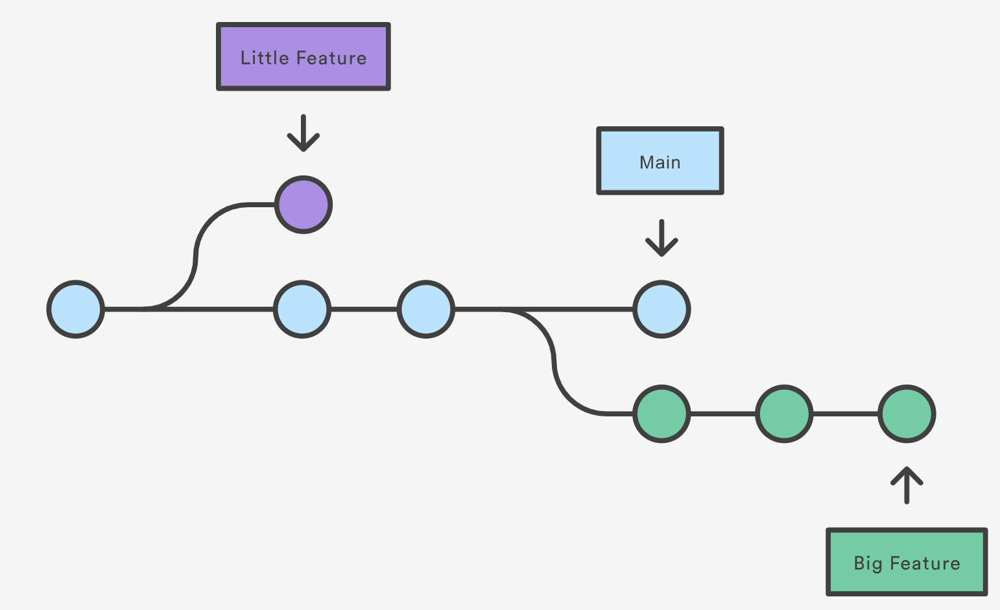
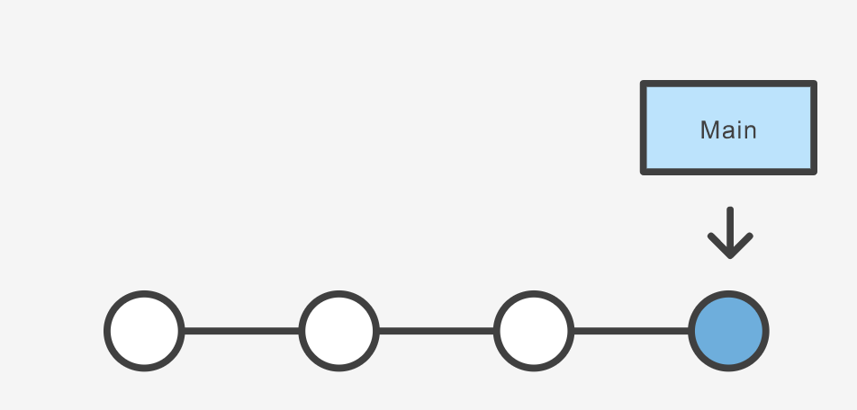
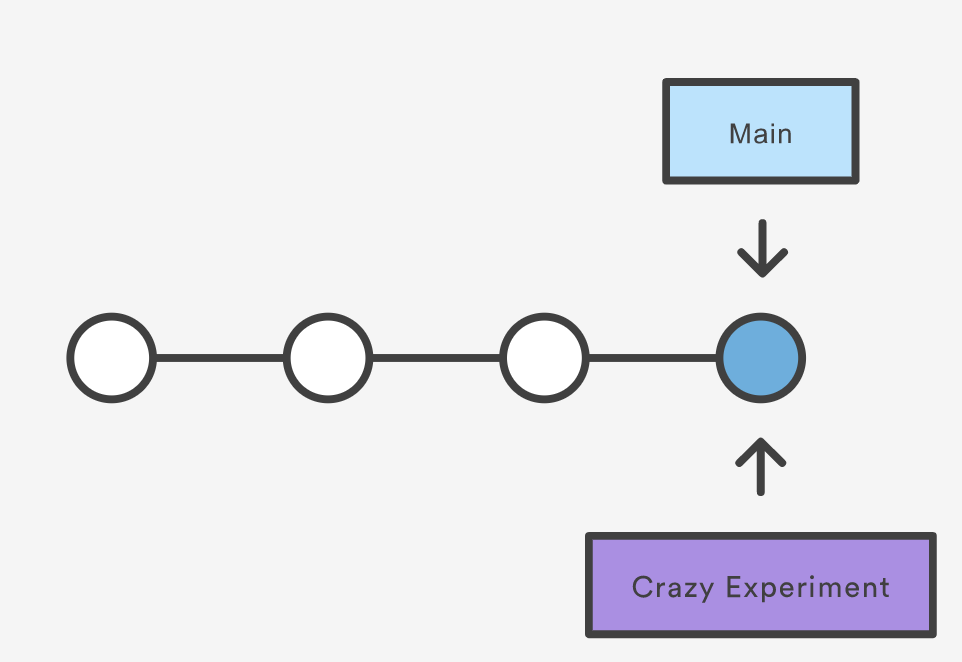

Branching is a feature available in most modern version control systems. Branching in other version control systems can be an expensive operation in both time and disk space. In `git`, branches are a part of your everyday development process. When you want to add a new feature or fix a bug—no matter how big or how small—you spawn a new branch to encapsulate your changes. This makes it harder for unstable code to get merged into the main code base, and it gives you the chance to clean up your future's history before merging it into the main branch.

The diagram above visualizes a repository with two isolated lines of development, one for a little feature, and one for a longer-running feature. By developing them in branches, it’s not only possible to work on both of them in parallel, but it also keeps the main branch free from questionable code.

The implementation behind Git branches is much more lightweight than other version control system models. Instead of copying files from directory to directory, Git stores a branch as a reference to a commit. In this sense, a branch represents the tip of a series of commits—it's not a container for commits. The history for a branch is extrapolated through the commit relationships.

(https://www.atlassian.com/git/tutorials/using-branches)

## What is a branch?

In `git` a branch is effectively a pointer to a snapshot of your changes. It's important to understand that branches are just pointers to commits. When you create a branch, all Git needs to do is create a new pointer, it doesn’t change the repository in any other way. If you start with a repository that looks like this:

Then, you create a branch using the following command:

~~~
git branch crazy-experiment
~~~
{: .language-bash}

The repository history remains unchanged. All you get is a new pointer to the current commit:

Note that this only creates the new branch. To start adding commits to it, you need to select it with `git checkout`, and then use the standard `git add` and `git commit` commands.

A branch *also* means an independent line of development. Branches serve as an abstraction for the edit/stage/commit process. New commits are recorded in the history for the current branch, which results in a fork in the history of the project. However, it is really important to remember that each commit only records the incremental change in the document and NOT the full history of changes. Therefore, while we think of a branch as a sequence of commits, each commit is independent unit of change.

## Branching Commands

Creating, deleting, and modifying branches is quick and easy; here’s a summary of the commands:

To list all branches:
~~~
git branch
~~~
{: .language-bash}

~~~
git branch -avv
~~~
{: .language-bash}

To create a new branch named `<branch>`, which *references the same point in history as the current branch.*
~~~
git branch <branch>
~~~
{: .language-bash}

To create a new branch named `<branch>`, referencing `<start-point>`, which may be specified any way you like, including using a branch name or a tag name:

~~~
git branch <branch> <start-point>
~~~
{: .language-bash}

To delete the branch `<branch>`; if the branch is not fully merged in its upstream branch or contained in the current branch, this command will fail with a warning:
~~~
git branch -d <branch>
~~~
{: .language-bash}

To delete the branch `<branch>` irrespective of its merged status:
~~~
git branch -D <branch>
~~~
{: .language-bash}

To switch to a different branch `<branch>`, updating the working directory to reflect the version referenced by `<branch>`.

~~~
git switch <branch>
~~~
{: .language-bash}

To create a new branch `<new>` referencing `<start-point>`, and check it out.

~~~
git switch -c <new> <start-point>
~~~
{: .language-bash}

The special symbol `"HEAD"` can always be used to refer to the current branch. In fact, Git uses a file named `HEAD` in the `.git` directory to remember which branch is current:

~~~
$ cat .git/HEAD
ref: refs/heads/master
~~~
{: .language-bash}

Renaming a branch can be done with the `-m` tag:
~~~
git branch -m <old-branch-name> <new-branch-name>
~~~
{: .language-bash}


