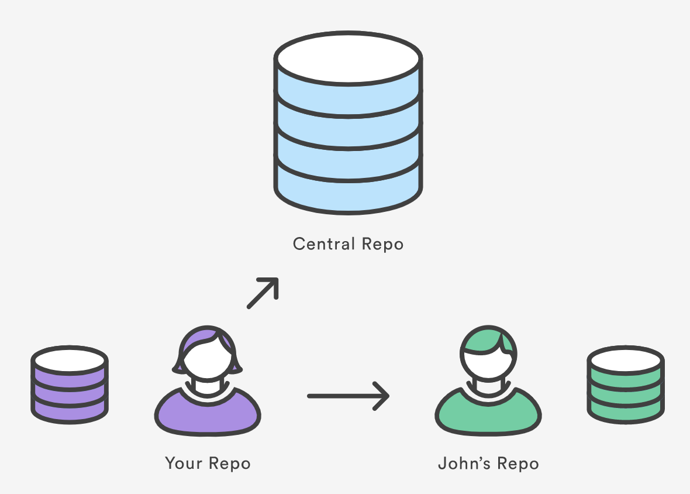

https://www.atlassian.com/git/tutorials/syncing

Git's distributed collaboration model, which gives every developer their own copy of the repository, complete with its own local history and branch structure. Users typically need to share a series of commits rather than a single "changeset". Instead of committing a "changeset" from a working copy to the central repository, Git lets you share entire branches between repositories.

## Git remote

The git remote command lets you create, view, and delete connections to other repositories. Remote connections are more like bookmarks rather than direct links into other repositories. Instead of providing real-time access to another repository, they serve as convenient names that can be used to reference a not-so-convenient URL.

For example, the diagram above shows two remote connections from your repo into the central repo and another developer’s repo. Instead of referencing them by their full URLs, you can pass the origin and john shortcuts to other Git commands.

The `git remote` command is essentially an interface for managing a list of remote entries that are stored in the repository's `./.git/config` file. The following commands are used to view the current state of the remote list.

Git is designed to give each developer an entirely isolated development environment. This means that information is not automatically passed back and forth between repositories. Instead, developers need to manually pull upstream commits into their local repository or manually push their local commits back up to the central repository. The `git remote` command is really just an easier way to pass URLs to these "sharing" commands.

## View Remote Configuration

To list the remote connections of your repository to other repositories you can use the `git remote` command:

~~~
git remote
~~~
{: .language-bash}

If you test this in our training repository, you should get only one connection, `origin`:
~~~
origin
~~~
{: .output}

When you clone a repository with `git clone`, `git` automatically creates a remote connection called `origin` pointing back to the cloned repository. This is useful for developers creating a local copy of a central repository, since it provides an easy way to pull upstream changes or publish local commits. This behaviour is also why most Git-based projects call their central repository origin.

We can ask `git` for a more verbose (`-v`) answer which gives us the URLs for the connections:

~~~
git remote -v
~~~
{: .language-bash}

For our training repository this should return:

~~~
origin	https://github.com/user_name/advanced-git-training.git (fetch)
origin	https://github.com/user_name/advanced-git-training.git (push)
~~~
{: .output}

As expected these point to the original repository we cloned.

## Create and Modify Connections

The `git remote` command also lets you manage connections with other repositories. The following commands will modify the repo's `./.git/config` file. The result of the following commands can also be achieved by directly editing the `./.git/config` file with a text editor.

Create a new connection to a remote repository. After adding a remote, you’ll be able to use `＜name＞` as a convenient shortcut for `＜url＞` in other Git commands.

~~~
git remote add <name> <url>
~~~
{: .language-bash}

Remove the connection:

~~~
git remote rm <name>
~~~
{: .language-bash}

Rename a connection:
~~~
git remote rename <old-name> <new-name>
~~~
{: .language-bash}

To get high-level information about the remote `＜name＞`:
~~~
git show <name>
~~~
{: .language-bash}

Exercise: Add a connection to your neighbour's repository. Having this kind of access to individual developers’ repositories makes it possible to collaborate outside of the central repository. This can be very useful for small teams working on a large project.

~~~
git remote add john http://dev.example.com/john.git
~~~
{: .language-bash}

## Starting a branch from the main repository state:

Remember that when you create a new branch without specifying a starting point, then the starting point will be the current state and branch. In order to avoid confusion, ALWAYS branch from the stable version. Here is how you would branch from your own origin/main branch:

~~~
git fetch origin main
git checkout -b <branch> origin/main
~~~
{: .language-bash}

You must fetch first so that you have the most recent state of the repository.

If there is another "true" version/state of the project, then this connection may be set as upstream (or something else). `Upstream` is a common name for the stable repository, then the sequence will be:

~~~
git fetch upstream main
git checkout -b <branch> upstream/main
~~~
{: .language-bash}

Now we can set the MPIA version of our repository as the upstream for our local copy.

Exercies: set the https://github.com/mpi-astronomy/advanced-git-training as the upstream locally.

~~~
git remote add upstream https://github.com/mpi-astronomy/advanced-git-training.git
git fetch upstream
git checkout -b develop upstream/develop
~~~
{: .language-bash}

Now examine the state of your repository with `git branch`, `git remote -v`, `git remote show upstream`


