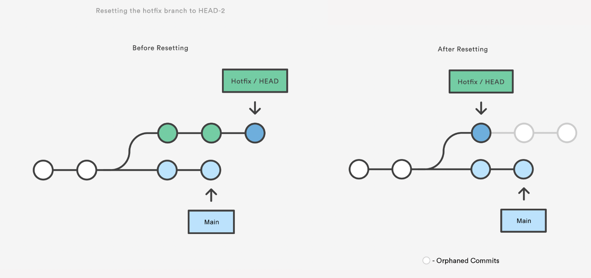
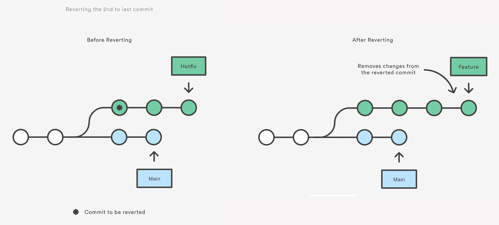
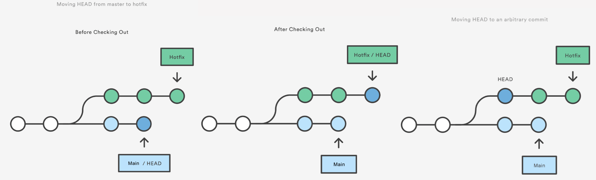
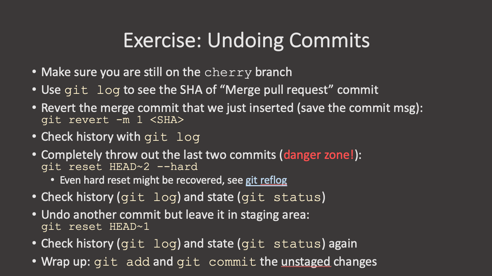

## Git Reset

Resetting is a way to move the tip of a branch to a different commit. This can be used to remove commits from the current branch. For example, the following command moves the `hotfix` branch backwards by two commits.

~~~
git checkout hotfix
git reset HEAD~2
~~~
{: .language-bash}

The two commits that were on the end of `hotfix` are now dangling, or orphaned commits. This means they will be deleted the next time `git` performs a garbage collection. In other words, you’re saying that you want to throw away these commits.

`git reset` is a simple way to undo changes that haven’t been shared with anyone else. It’s your go-to command when you’ve started working on a feature and find yourself thinking, “Oh crap, what am I doing? I should just start over.”

In addition to moving the current branch, you can also get `git reset` to alter the staged snapshot and/or the working directory by passing it one of the following flags:

__--soft__ – The staged snapshot and working directory are not altered in any way.

__--mixed__ – The staged snapshot is updated to match the specified commit, but the working directory is not affected. __This is the default option__.

__--hard__ – The staged snapshot and the working directory are both updated to match the specified commit.

It’s easier to think of these modes as defining the scope of a git reset operation.

To just undo any uncommitted changes:

~~~
git reset HEAD
~~~
{: .language-bash}

`git reset` can also work on a single file:

~~~
git reset HEAD~2 foo.txt
~~~
{: .language-bash}

## Git Revert

Reverting undoes a commit by creating a new commit. This is a safe way to undo changes, as it has no chance of re-writing the commit history. For example, the following command will figure out the changes contained in the 2nd to last commit, create a new commit undoing those changes, and tack the new commit onto the existing project.

~~~
git checkout hotfix
git revert HEAD~2
~~~
{: .language-bash}

Note that revert only backs out the atomic changes of the specific commit (by default, you can also give it a range of commits but we are not going to do that here, see the help).

`git revert` does not rewrite history which is why it is the preferred way of dealing with issues when the changes have already been pushed to a remote repository.

## Git Checkout: A Gentle Way

We already saw that `git checkout` is used to move to a different branch but is can also be used to update the state of the repository to a specific point in the projects history.

~~~
git checkout hotfix
git checkout HEAD~2
~~~
{: .language-bash}

https://www.atlassian.com/git/tutorials/resetting-checking-out-and-reverting

## Exercise: Undoing Changes

> - Create a new branch called `hotfix`. Create a new file and make 3-4 commits in that file. Check the log to see the SHA of the last commit.
> 
> > ## Solution
> > ~~~
> > git status
> > git log
> > ~~~
> > {: .language-bash}
> {: .solution}
{: .challenge}

> - Revert the last commit that we just inserted. Check the history.
> 
> > ## Solution
> > ~~~
> > git revert -m 1 <SHA>
> > git log
> > ~~~
> > {: .language-bash}
> {: .solution}
{: .challenge}

> - Completely throw away the last two commits [DANGER ZONE!!!]. Check the status and the log.
> 
> > ## Solution
> > ~~~
> > git reset HEAD~2 --hard
> > git status
> > git log
> > ~~~
> > {: .language-bash}
> {: .solution}
{: .challenge}

> - Undo another commit but leave it in the staging area. Check the status and log.
> 
> > ## Solution
> > ~~~
> > git reset HEAD~1
> > git status
> > git log
> > ~~~
> > {: .language-bash}
> {: .solution}
{: .challenge}

> - Wrap it up: add and commit the changes.
> 
> > ## Solution
> > ~~~
> > git add .
> > git commit -m "Message"
> > ~~~
> > {: .language-bash}
> {: .solution}
{: .challenge}

<!---  --->


