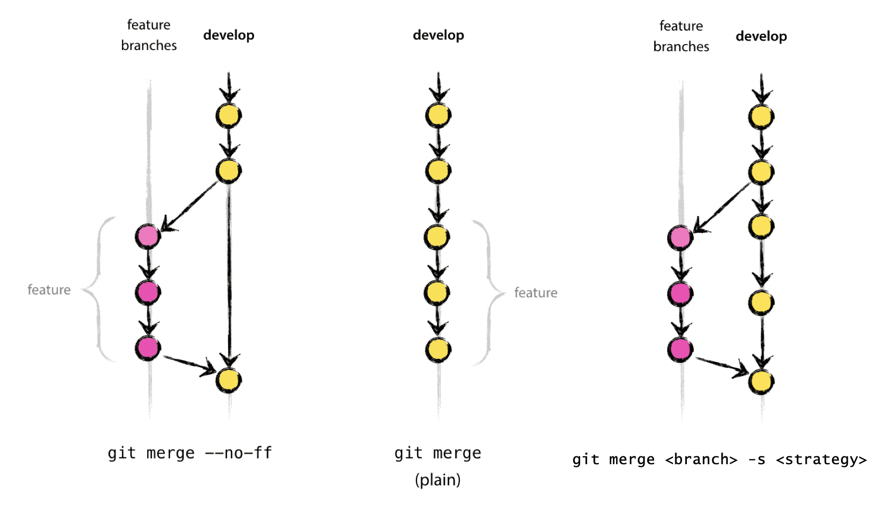

Even if you live well, one day you will have to merge a branch. Your branch may or may not have diverged from the main branch. The command that accomplishes this is `git merge`.

There are 3 ways to merge:

- fast forward merged

- non-fast-forward merged

- three way

Reminder: when starting work on a new feature, be careful where you branch from!

~~~
git remote add upstream https://github.com/mpi-astronomy/advanced-git-training.git
git fetch upstream
git checkout -b develop upstream/develop
~~~
{: .language-bash}

## Fast-forward Merger

If there are no conflicts with the main branch, a "fast-forward" merge can be executed with. This will NOT create a merge commit! Aborts merge if it cannot be done.
Ideal for updating a branch from remote.

~~~
git checkout main
git merge --ff-only <branch>
~~~
{: .language-bash}

Using the fast-forward merge it is impossible to see from the `git` history which of the commit objects together have implemented a feature. You would have to manually read all the log messages. Reverting a whole feature (i.e. a group of commits), is a true headache in the latter situation, whereas it is easily done if the --no-ff flag was used.

## Non-fast-forwad Merge

Merges branch by creating a merge commit. Prompts for merge commit message. Ideal for merging two branches.

~~~
git checkout main
git merge --no-ff <branch>
~~~
{: .language-bash}

The `--no-ff` flag causes the merge to always create a new commit object, even if the merge could be performed with a fast-forward. This avoids losing information about the historical existence of a feature branch and groups together all commits that together added the feature.

### Three-way Merger

Similar to `--no-ff`, but there may be dragons. Forced upon you when there’s an intermediate change since you branched.
May prompt your to manually resolve

~~~
git merge <branch> [-s <strategy>]
~~~
{: .language-bash}

See https://git-scm.com/docs/merge-strategies for a zillion options (“patience”, “octopus”, etc),  But also git is only so smart and you are probably smarter.

Merging strategies: https://git-scm.com/docs/merge-strategies

[comment]: <> ()
[comment]: <> (
[comment]: <> ()
[comment]: <> ()
[comment]: <> ()

https://nvie.com/posts/a-successful-git-branching-model/

Note: there are a number of external tools that have a graphical interface to allow for merge conflict resolution. Some of these include: kdiff3 (Windows, Mac, Linux), Meld (Windows, Linux), P4Merge (Windows, Mac, Linux),  opendiff (Mac), vimdiff (for Vim users), Beyond Compare, GitHub web interface. We do not endorse any of them and use at your own risk. In any case, using a graphical interface does not substitute for understanding what is happening under the hood.


