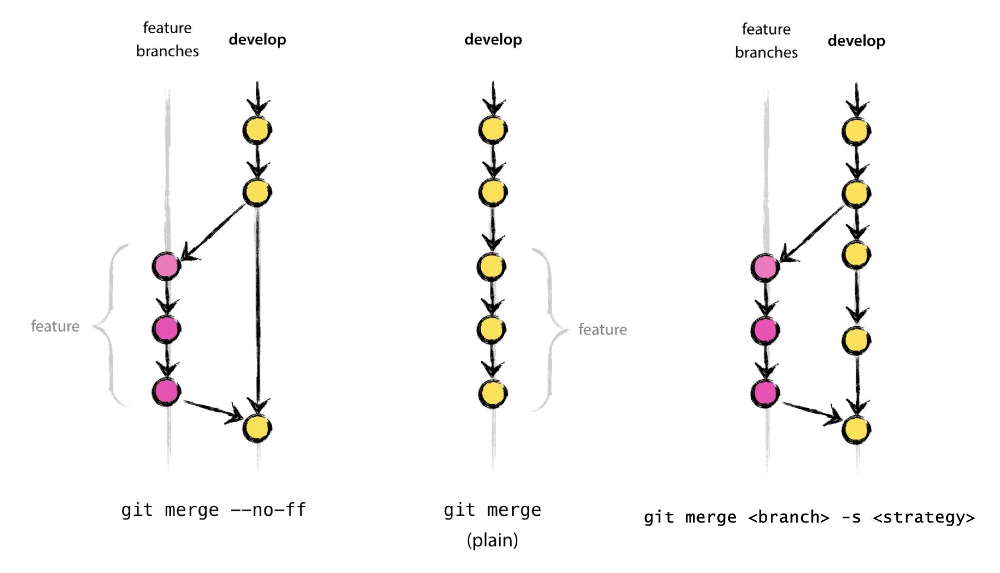
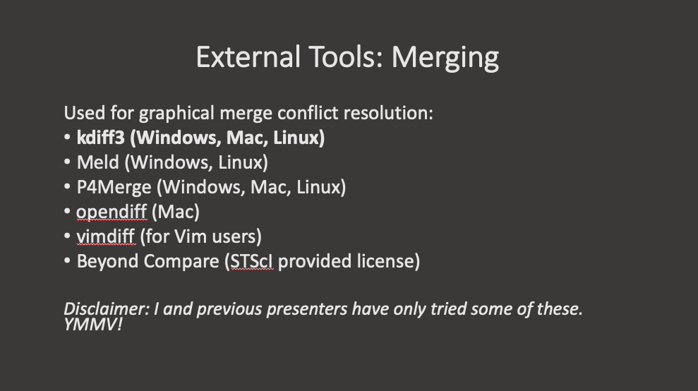
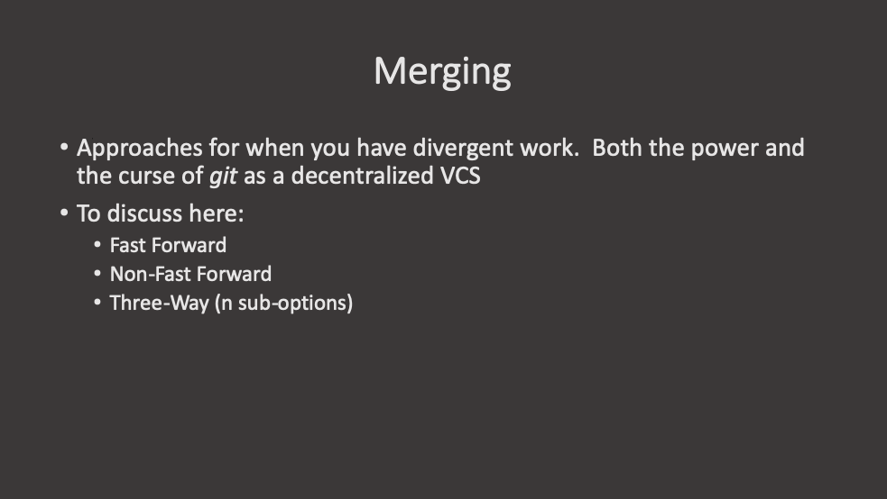
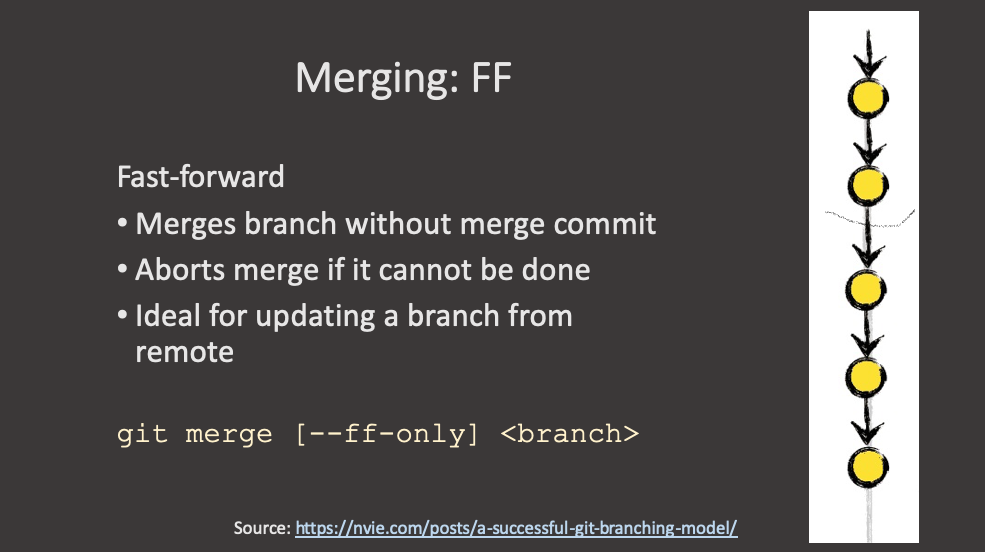
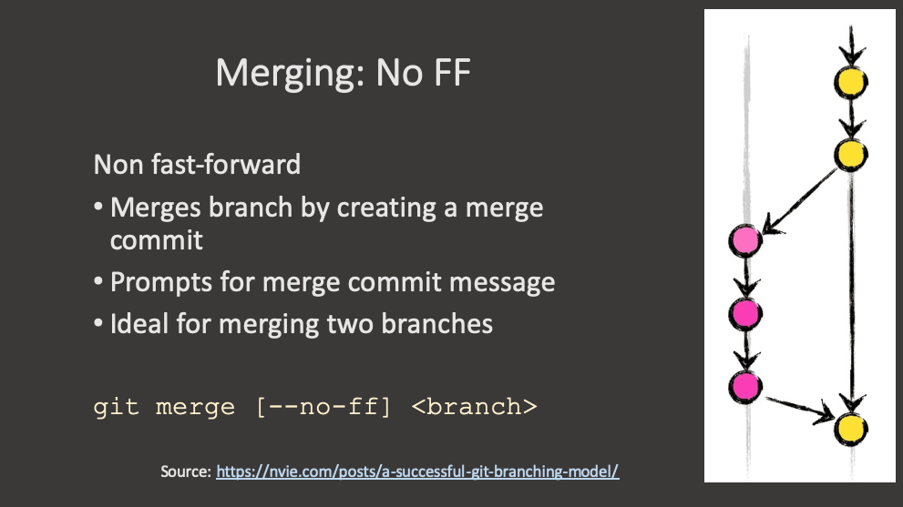
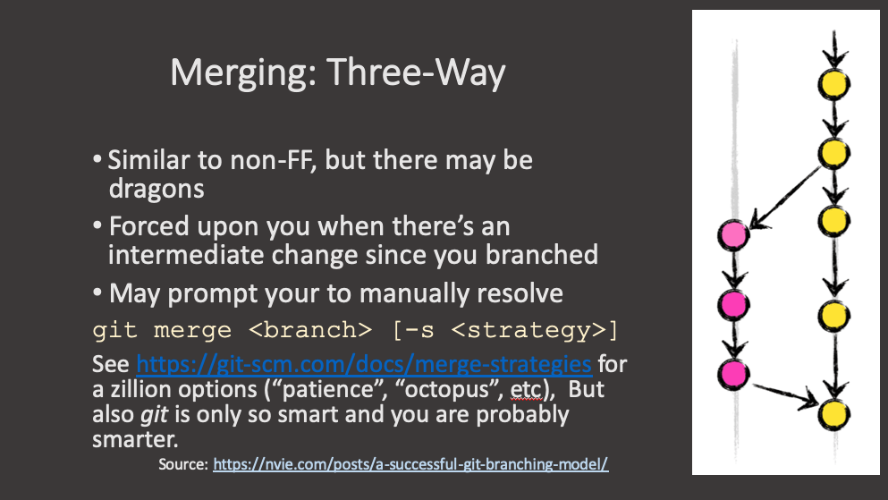

When you are collaborating, you will have to merge a branch whether or not it has diverged from the main branch. Most of the Git hosting platforms like GiHub or GitLab allow you to merge a branch from their web interface but you can also merge the branches from your machine using `git merge`.

There are two ways to merge:

- non-fast-forward merge (recommended)

- fast forward merge

Reminder: when starting work on a new feature, be careful where you branch from!

~~~
git remote add upstream https://github.com/mpi-astronomy/advanced-git-training.git
git fetch upstream
git checkout -b develop upstream/develop
~~~
{: .language-bash}

## Non-fast-forwad Merge

Merge branches by creating a merge commit, which prompts for merge commit message. This is ideal for merging two branches.

~~~
git checkout main
git merge --no-ff <branch> -m "Message"
~~~
{: .language-bash}

The `--no-ff` flag causes the merge to always create a new commit object, even if the merge could be performed with a fast-forward. This avoids losing information about the historical existence of a feature branch and groups together all commits that added the feature.

## Exercise: Creating a non-fast-forwad merge.

> Create a new Git repository that has the following tree.
>
> ~~~
> *   69fac81 (main) Merge branch 'gitignore'
> |\  
> | * 5537012 (gitignore) Add .gitignore
> |/  
> * 6ec7c0f Add README
> ~~~
> 
> > ## Solution
> > ~~~
> > git init
> > touch README.md
> > git add README.md
> > git commit -m 'Add README'
> > git checkout -b gitignore
> > touch .gitignore
> > git add .gitignore
> > git commit -m "Add .gitignore"
> > git checkout main
> > git merge --no-ff gitignore
> > ~~~
> > {: .language-bash}
> {: .solution}
{: .challenge}

## Fast-forward Merge

If there are no conflicts with the main branch, a "fast-forward" merge can be executed with the command listed below. This will NOT create a merge commit! Additionally, this command aborts the merge if it cannot be done.
Ideal for updating a branch from remote.

~~~
git checkout main
git merge --ff-only <branch>
~~~
{: .language-bash}

If using the fast-forward merge, it is impossible to see from the `git` history which of the commit objects together have implemented a feature. You would have to manually read all the log messages. Reverting a whole feature (i.e. a group of commits), is a true headache in the latter situation, whereas it is easily done if the --no-ff flag was used.

For a good illustration of fast-forward merge (and other concepts), see this [thread](https://stackoverflow.com/questions/9069061/what-effect-does-the-no-ff-flag-have-for-git-merge)

## Exercise: Creating a fast-forwad merge.

> Consider the following Git tree
>
> ~~~
> * a78b99f (main) Add title
> | * 3d88062 (remote) Add .gitignore
> |/  
> * 86c4247 Add README
> ~~~
> 
> Is it possible to run a fast-forward merge to incorporate the branch `remote` into `main`?
> > ## Solution
> > It is not possible to run a fast-forward merge because of commit `a78b99f`. 
> > {: .language-bash}
> {: .solution}
{: .challenge}

### Three-way Merge

Similar to `--no-ff`, but there may be dragons. This method is forced upon you when there’s an intermediate change since you branched.
This may prompt you to manually resolve

~~~
git merge <branch> [-s <strategy>]
~~~
{: .language-bash}

See [merge strategies](https://git-scm.com/docs/merge-strategies) for several options (“patience”, “octopus”, etc). Whichever strategy you use, git is only so smart and you are probably smarter.

[comment]: <> ()
[comment]: <> (
[comment]: <> ()
[comment]: <> ()
[comment]: <> ()

More on [a successful Git branching model](https://nvie.com/posts/a-successful-git-branching-model/)

Note: there are a number of external tools that have a graphical interface to allow for merge conflict resolution. Some of these include: kdiff3 (Windows, Mac, Linux), Meld (Windows, Linux), P4Merge (Windows, Mac, Linux),  opendiff (Mac), vimdiff (for Vim users), Beyond Compare, GitHub web interface. We do not endorse any of them and use at your own risk. In any case, using a graphical interface does not substitute for understanding what is happening under the hood.


