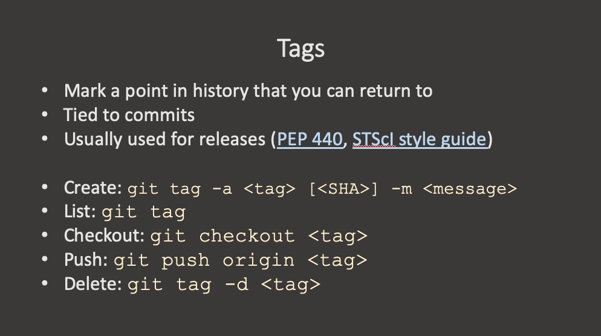

A tag is a marker of a specic commit in the project history. You can think of it as a permanent bookmark. Tags can be created to point to a release version, a major code change, a state of the code that was used to produce a paper or a data release, or any other event you (or the development team) may want to reference in the future. 

Once a tag has been created, no other changes can be added to it. But you can delete it and create a new one with the same name. 

Don't name your tags the same as your branches. Or the other way around. git fetch can get a tag or a branch and that can be confusing.

The command that allows you to handle git tags is just `git tag`. Without any flags it simply list the existing tags:

~~~
git tag 
~~~
{: .language-bash}

You can create a new tag based on the current state of the repository by providing a tag name to the `git tag` command:
~~~
git tag 1.0.0
~~~
{: .language-bash}

This however creates what is called a `lightweight tag`. Lightweight tags are like a branch that doesn't change.

You can get information on a tag via `git show`:

~~~
git show 1.0.0
~~~
{: .language-bash}

Lightweight tags are not recommended in most use cases because they do not save all the information. Instead, use `annotated tags` (https://git-scm.com/book/en/v2/Git-Basics-Tagging). They are stored as full objects in the Git database: they’re checksummed; contain the tagger name, email, and date; have a tagging message; and can be signed and verified with GNU Privacy Guard (GPG). 

To create an annotated tag from the current commit:
~~~
git tag -a 2.0.0 -m <message>
~~~
{: .language-bash}

It is also possible to tag a past commit by providing that commit's SHA:
~~~
git tag -a <tag> [<SHA>] -m <message>
~~~
{: .language-bash}

To get more information about an existing tag you can "verify" it, which displays that tag's details, including the tagger, date, and message. This only works for annotated commits:
~~~
git tag -v 1.0.0
git tag -v 2.0.0
~~~
{: .language-bash}

A tag allows you to switch to the version of the code that was tagged, to use that version of the code, or to see what the code looked at that tag. Here is how to check out a state of the code that has been tagged:
~~~
git checkout <tag> 
~~~
{: .language-bash}

Push a tag to origin:
~~~
git push origin <tag>
~~~
{: .language-bash}

And of course you can delete a tag. This does not delete the commit, just removes the marker/lable. Delete a tag:
~~~
git tag -d <tag>
~~~
{: .language-bash}

Since tags are frequently used to do releases, it is useful to be aware that codebases and languages have standards on how release versions should be labled. If you are working with an existing code base, follow the standard set by the dev team. If you are developing a library by yourself, follow the standards for the language. For example, the (Python Packaging Authority)[https://packaging.python.org/en/latest/specifications/version-specifiers/#version-specifiers] (and previously(PEP440)[https://peps.python.org/pep-0440/]) specifies the scheme for identifying versions for `python` libraries. 

<!--- ---> 


