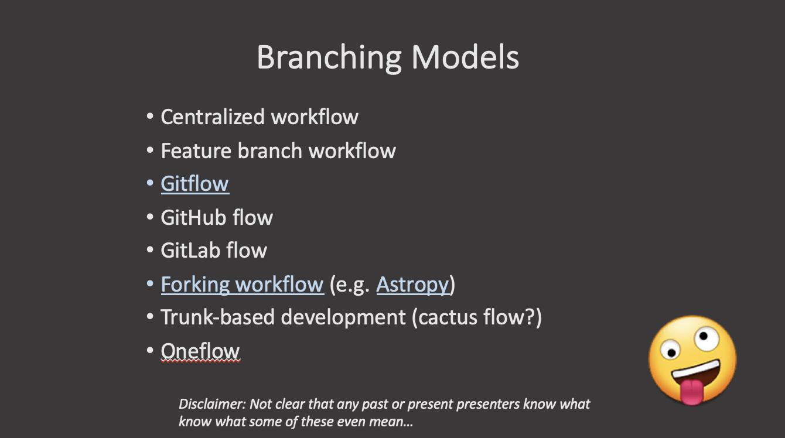

## What is a branching model/strategy?

Branches are primarily used as a means for teams to develop features giving them a separate workspace for their code. These branches are usually merged back to a master branch upon completion of work. In this way, features (and any bug and bug fixes) are kept apart from each other allowing you to fix mistakes more easily.

This means that branches protect the mainline of code and any changes made to any given branch don’t affect other developers.

A branching strategy, therefore, is the strategy that software development teams adopt when writing, merging and deploying code when using a version control system.

It is essentially a set of rules that developers can follow to stipulate how they interact with a shared codebase.

Such a strategy is necessary as it helps keep repositories organized to avoid errors in the application and the dreaded merge hell when multiple developers are working simultaneously and are all adding their changes at the same time. Such merge conflicts would eventually deter the combination of contributions from multiple developers.

Thus, adhering to a branching strategy will help solve this issue so that developers can work together without stepping on each other’s toes. In other words, it enables teams to work in parallel to achieve faster releases and fewer conflicts by creating a clear process when making changes to source control.

When we talk about branches, we are referring to independent lines of code that branch off the master branch, allowing developers to work independently before merging their changes back to the code base.

In this and the following episodes, we will outline some of the branching strategies that teams use in order to organize their workflow where we will look at their pros and cons and which strategy you should choose based on your needs, objectives and your team’s capabilities.

## Why do you need a branching model?

As mentioned above, having a branching model is necessary to avoid conflicts when merging and to allow for the easier integration of changes into the master trunk.

A BRANCHING MODEL AIMS TO:
- Enhance productivity by ensuring proper coordination among developers
- Enable parallel development
- Help organize a series of planned, structured releases
- Map a clear path when making changes to software through to production
- Maintain a bug-free code where developers can quickly fix issues and get these changes back to production without disrupting the development workflow

## Git Branching Models

Some version control systems are Very Opinionated about the branching models that can be used. `git` is very much (fortunately or unfortunately) not. This means that there are many different ways to do development in a team and the team needs to explicitly agree on how and when to merge contributions to the main branch. So the first rule of `git` granching is: "Talk about your branching model." The second rule is: "Talk about your branching model." If in doubt, do what other people around you are doing. If they don't do anything, call a friend.

That said, there are a number of established (and less so) branching models that are used with `git`. These include, but are not limited to:

- **Centralized workflow**: enables all team members to make changes directly to the main branch. Every change is logged into the history. In this workflow, the contributors do not use other branches. Instead they all make changes on the main branch directly and commit to it. This woks for individual developers or small thema which communicate very well, but can be tricky for larger teams: the code is in constant state of flux and developers keep changes local until they are ready to release.

- **Trunk-based development** (cactus flow?): is somewhat similar to the centralized workflow. The development happens on a single branch called `trunk`. When changes need to be merged, each developer pulls and rebases from the trunk branch and resolves conflicts locally. This can work if small merges are made frequently and is more successful if there is CI/CD.
  
- **Feature branch workflow**: every small change or "feature" gets its own branch where the developers make changes. Once the feature is done, they submit a merge/pull request and merge it into the main branch. Features branches should be relatively short-lived. The benefit of this model is that the main branch is not poluted by unfinished features. Good for teams.
  
- **Gitflow**: is a model where the main development happens in a develop branch with feature branches. When the develop branch is ready for a release (or to go into production), a team member creates a release branch which is tested and eventually merged onto the dev and eventually main branch.
  
- **GitHub flow** (https://docs.github.com/en/get-started/quickstart/github-flow): similar to the branching workflow.
  
- **GitLab flow**: is a simplified version of Gitflow (https://about.gitlab.com/topics/version-control/what-is-gitlab-flow/)

- **Oneflow**: is similar to Gitflow but relies on the maintanance of one long-lived branch. It is meant to be simpler, without a develop branch but feature branches still exist (https://www.endoflineblog.com/oneflow-a-git-branching-model-and-workflow).
  
- **Forking workflow** (e.g. astropy): is a model where each contributor creates a `fork` or a complete copy of the repository. Every contribitor effectively has two repositories: his own and the main (upstream) one. Changes are made as pull requests against the main repository. This model is propular with open source projects because the vast majority of contributors do not need to have priviledges in the main repository. 

A longer description of some of these can be found here: https://about.gitlab.com/topics/version-control/what-is-git-workflow/#feature-branching-git-workflow

In summary, there are many different ways to collaborate on a project. Look at the pros and cons and select one that fits the needs and organization of your team and project. In the following several sections we look at some of these models in more detail.

<!---  --->
<!---  --->


