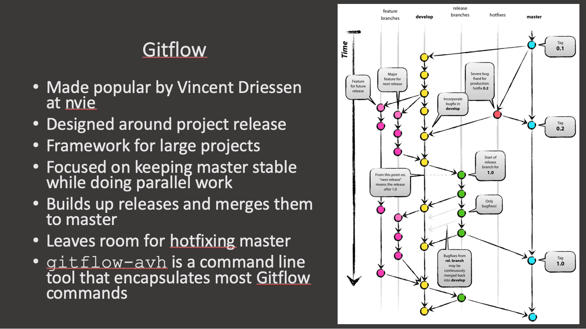
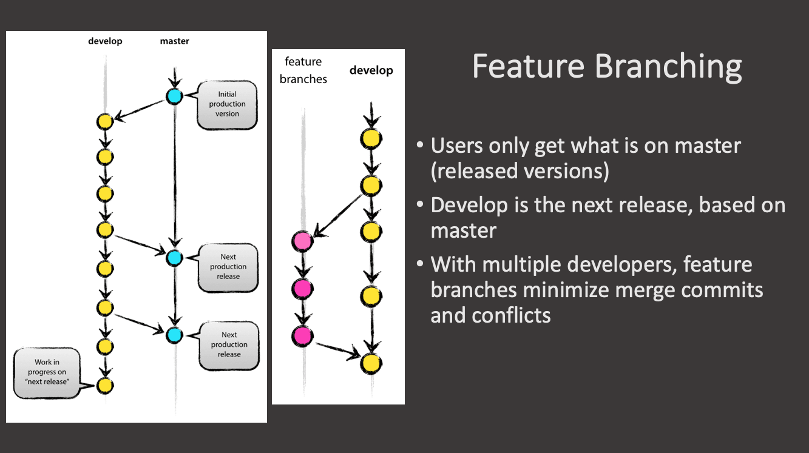
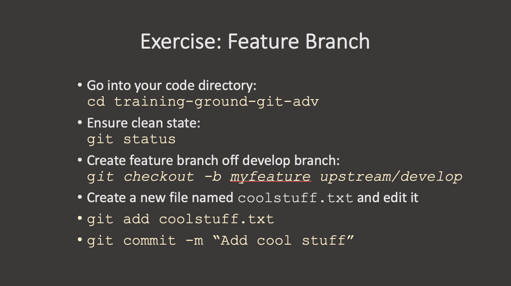
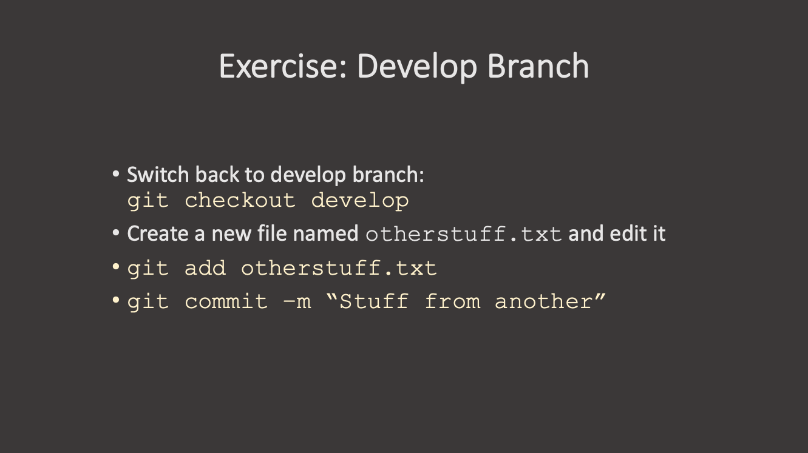
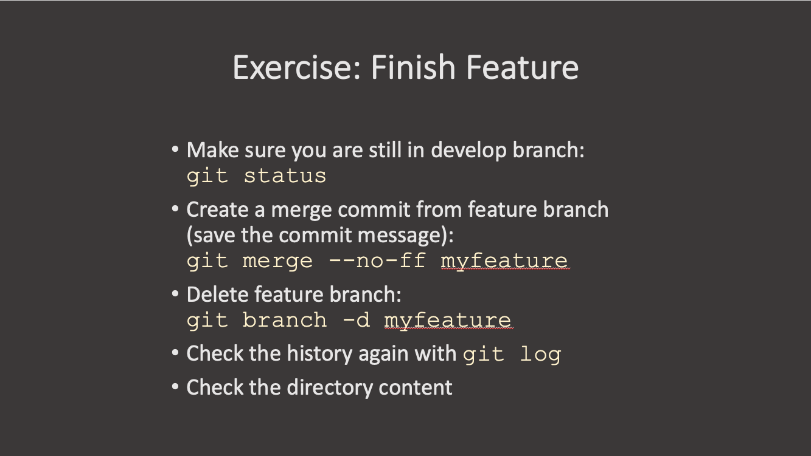
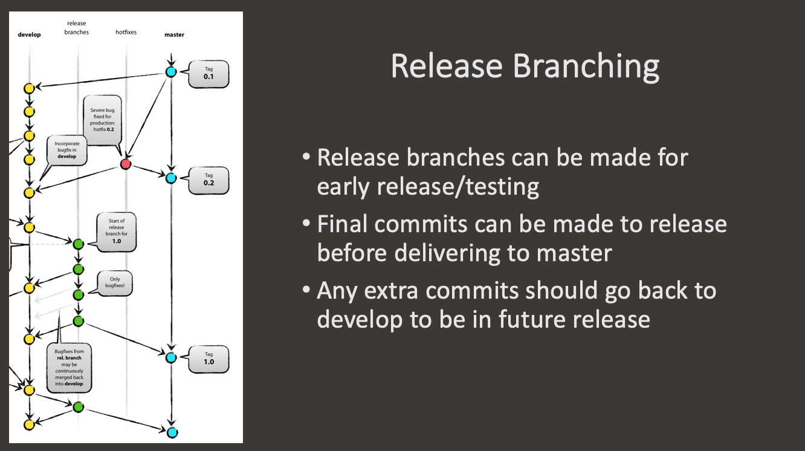
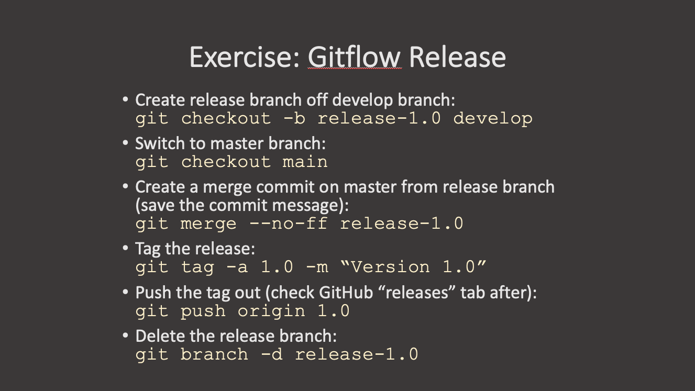
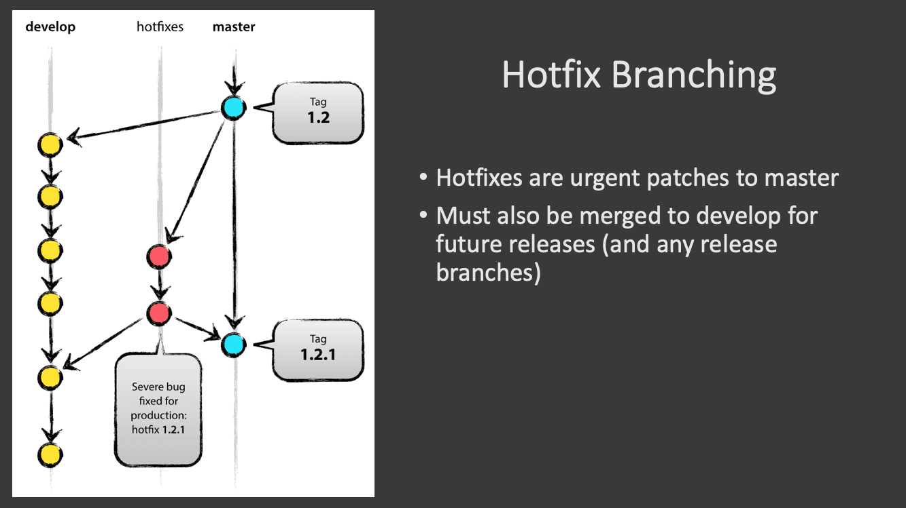
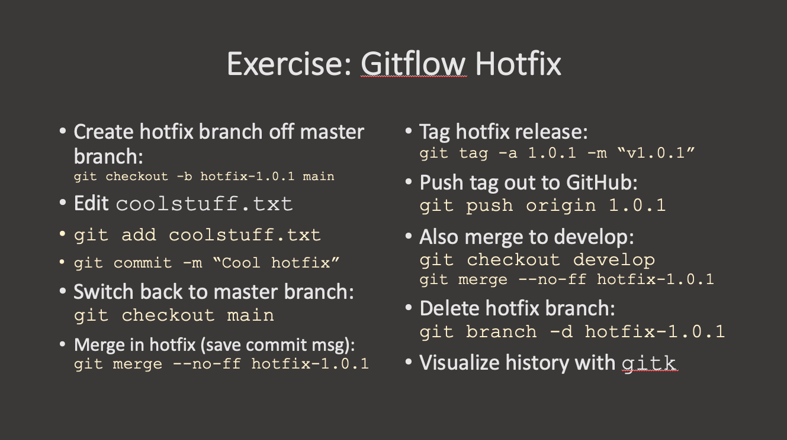
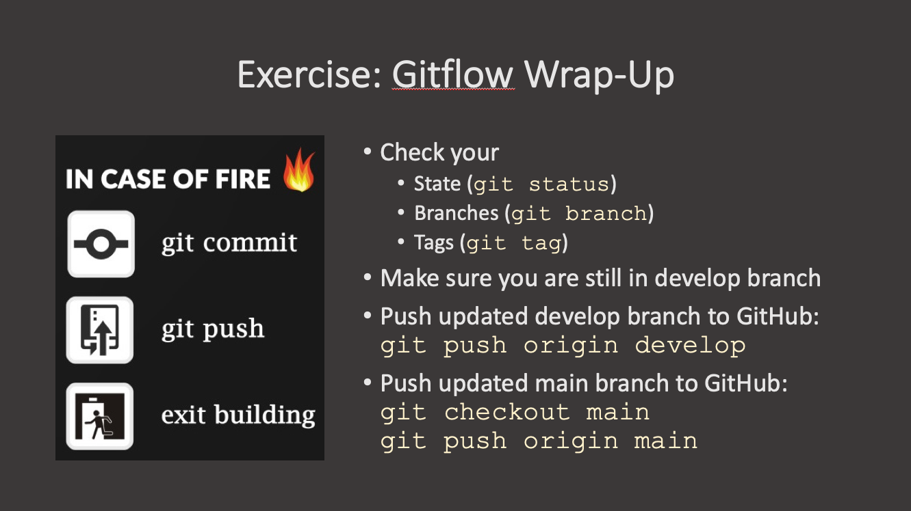

Considered to be a bit complicated and advanced for many of today’s projects, `GitFlow` enables parallel development where developers can work separately from the master branch on features where a feature branch is created from the master branch.

Afterwards, when changes are complete, the developer merges these changes back to the master branch for release.

This branching strategy consists of the following branches:

- Master
- Develop
- Feature- to develop new features that branches off the develop branch
- Release- help prepare a new production release; usually branched from the develop branch and must be merged back to both develop and master
- Hotfix- also helps prepare for a release but unlike release branches, hotfix branches arise from a bug that has been discovered and must be resolved; it enables developers to keep working on their own changes on the develop branch while the bug is being fixed.

The main and develop branches are considered to be the main branches, with an infinite lifetime, while the rest are supporting branches that are meant to aid parallel development among developers, usually short-lived.

## GitFlow pros and cons

Perhaps the most obvious benefit of this model is that it allows for parallel development to protect the production code so the main branch remains stable for release while developers work on separate branches.

Moreover, the various types of branches make it easier for developers to organize their work. This strategy contains separate and straightforward branches for specific purposes though for that reason it may become complicated for many use cases.

It is also ideal when handling multiple versions of the production code.

However, as more branches are added, they may become difficult to manage as developers merge their changes from the development branch to the main. Developers will first need to create the release branch then make sure any final work is also merged back into the development branch and then that release branch will need to be merged into the main branch.

In the event that changes are tested and the test fails, it would become increasingly difficult to figure out where the issue is exactly as developers are lost in a sea of commits.

Indeed, due to GitFlow’s complexity, it could slow down the development process and release cycle. In that sense, GitFlow is not an efficient approach for teams wanting to implement continuous integration and continuous delivery.

## Exercise 1: Creating a Feature Branch

> - First go into the repository directory and check the repository status. Make sure the status is clean and, if not, commit any changes. 
>
> > ## Solution
> > ~~~
> > cd advanced-git-training
> > git status
> > ~~~
> > {: .language-bash}
> {: .solution}
{: .challenge}

> - Check out a new feature branch off the development branch. 
>
> > ## Solution
> > ~~~
> > git checkout -b myfeature upstream/develop
> > ~~~
> > {: .language-bash}
> {: .solution}
{: .challenge}

> - Create a new file that will contain your feature, edit it and commit it:
>
> > ## Solution
> > ~~~
> > git add coolstuff.txt
> > git commit -m "Add cool stuff."
> > ~~~
> > {: .language-bash}
> {: .solution}
{: .challenge}

Now you have a feature branch.

## Exercise 2: Making Changes on the `develop` Branch

Now, while you were developing your feature, someone else merged their changes, `otherstuff.txt` in the develop branch. Let's make those changes here by hand so we can then practice merging our `coolfeature` into the `develop` branch.

> - Check out the `develop` branch:
> 
> > ## Solution
> > ~~~
> > git checkout develop
> > ~~~
> > {: .language-bash}
> {: .solution}
{: .challenge}

> - Create a new file named, for example, `otherstuff.txt`, edit it, add it and commit it to the develop branch:
>
> > ## Solution
> > ~~~
> > git add otherstuff.txt
> > git commot -m "Stuff from another feature."
> > ~~~
> > {: .language-bash}
> {: .solution}
{: .challenge}

## Exercise 3: Finish Feature

Now we are going to merge the `myfeature` branch into `develop`. Make sure you are still on the `develop` branch by checking the status `git status`.

> - Create a merge commit from the `myfeature` branch:
>
> > ## Solution 
> > ~~~
> > git merge --no-ff myfeature
> > ~~~
> > {: .language-bash}
> {: .solution}
{: .challenge}

> -Delete the feature branch:
>
> > ## Solution 
> > ~~~
> > git branch -d myfeature
> > ~~~
> > {: .language-bash}
> {: .solution}
{: .challenge}
 

Finally, check the history again with `git log` and check the direcotry content with `ls`. Is your feature file here?

<!---  --->
<!---  --->
<!---  --->

## Gitflow Release Branching

 

## Exercise 4: Gitflow Release

> - First we need to create a release branch. Release branches should start from the `develop` branch.
> 
> > ## Solution 
> > ~~~
> > git checkout -b release-1.0 develop
> > ~~~
> > {: .language-bash}
> {: .solution}
{: .challenge}
 
> - The switch to the `main` branch. We will merge the release branch into `main`. Create a merge commit on `main` from `release-1.0`:
> 
> > ## Solution 
> > ~~~
> > git checkout main
> > git merge --no-ff release-1.0
> > ~~~
> > {: .language-bash}
> {: .solution}
{: .challenge}

> - Now we can tag the release, push the tag out and delete the release branch:
> 
> > ## Solution 
> > ~~~
> > git tag -a 1.0 -m "Version 1.0"
> > git push origin 1.0
> > git branch -d release-1.0
> > ~~~
> > {: .language-bash}
> {: .solution}
{: .challenge}

You can now check the Releases tab on GitHub to see your tagged release.

<!---   --->

## Gitflow Hotfix

## Exercise 5: Gitflow Hotfix

Imagine we made a release but we realized that there is a bug in our cool feature in `coolstuff.txt`. How do we fix that? We make a hotfix on the code which we then merge into both `main` and `develop` and we tag a new hotfix release.

> - First, create a hotfix branch off main, this is where our released code lives, we need to fix it:
> 
> > ## Solution 
> > ~~~
> > git checkout -b hotfix-1.0.1 main
> > ~~~
> > {: .language-bash}
> {: .solution}
{: .challenge}

> - Now, make some changes to `coolstuff.txt`, add and commit it:
> 
> > ## Solution 
> > ~~~
> > git add coolstuff.txt
> > git commit -m "Cool hotfix"
> > ~~~
> > {: .language-bash}
> {: .solution}
{: .challenge}

> - Switch back to the main branch and merge the commit:
> 
> > ## Solution 
> > ~~~
> > git checkout main
> > git merge --no-ff hotfix-1.0.1
> > ~~~
> > {: .language-bash}
> {: .solution}
{: .challenge}

> - Tag a new release and push it to GitHub:
> 
> > ## Solution 
> > ~~~
> > git tag -a 1.0.1 -m "Version 1.0.1"
> > git push origin 1.0.1
> > ~~~
> > {: .language-bash}
> {: .solution}
{: .challenge}

> - We also need to merge our change to `develop` so that it is propagated into the code that is the same as the released version:
> 
> > ## Solution 
> > ~~~
> > git checkout develop
> > git merge --no-ff hotfix-1.0.1
> > ~~~
> > {: .language-bash}
> {: .solution}
{: .challenge}

> - Finally we can delete the hotfix branch:
> 
> > ## Solution 
> > ~~~
> > git branch -d hotfix-1.0.1
> > ~~~
> > {: .language-bash}
> {: .solution}
{: .challenge}

## Exercise 6: Gitflow Wrap-up

To wrap up the Gitflow workflow we want to make sure we have pushed all our `develop` and `main` changes to the remote repository. 

> - First, as always, check the status of your repository and make sure you are still on the `develop` branch:
> 
> > ## Solution 
> > ~~~
> > git status
> > git branch
> > git tag
> > ~~~
> > {: .language-bash}
> {: .solution}
{: .challenge}

> - Then push any changes from develop to the remote:
> 
> > ## Solution 
> > ~~~
> > git push origin develop
> > ~~~
> > {: .language-bash}
> {: .solution}
{: .challenge}

> - And do the same with the `main` branch:
> 
> > ## Solution 
> > ~~~
> > git checkout main
> > git push origin main
> > ~~~
> > {: .language-bash}
> {: .solution}
{: .challenge}

https://www.flagship.io/git-branching-strategies/


