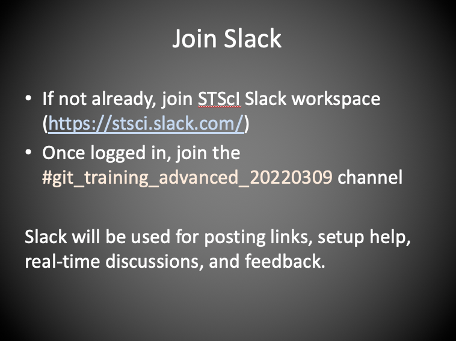
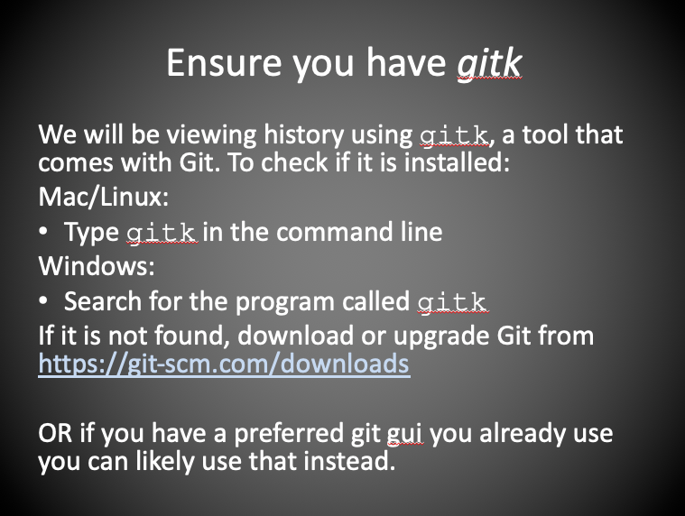
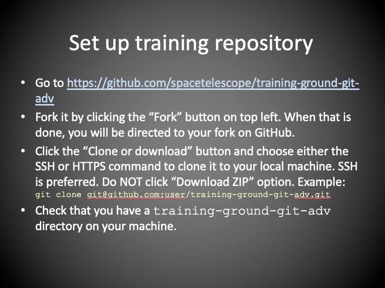

This training assumes you are already familiar with the material of the Introductory Git Training (https://swcarpentry.github.io/git-novice/) and that you have at least three months of experience using `git` for your own projects.

In order to try out the commands in this lesson we need to set up a repository on GitHub:

- Go to https://github.com/mpi-astronomy/advanced-git-training
- Click on the `Fork` button on the top right and follow the instructions. When this is process is done, you will be directed to your copy of the repository on GitHub.
- Click the green `Code` button. Copy the `SSH` or `HTTPS` path to the repository to your local machine. Do not download a ZIP file.
- Create a local copy. The command will be similar to this but with a link to your own repo:
~~~
git clone https://github.com/user-name/advanced-git-training.git
~~~
{: .language-bash}
The current GitHub recommendation is to use the `HTTPS`.

[comment]: <> ()
[comment]: <> ()
[comment]: <> ()
[comment]: <> ()


